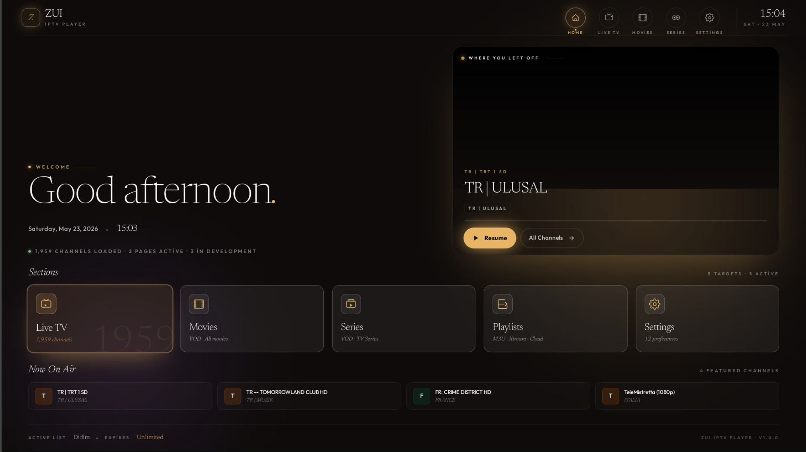
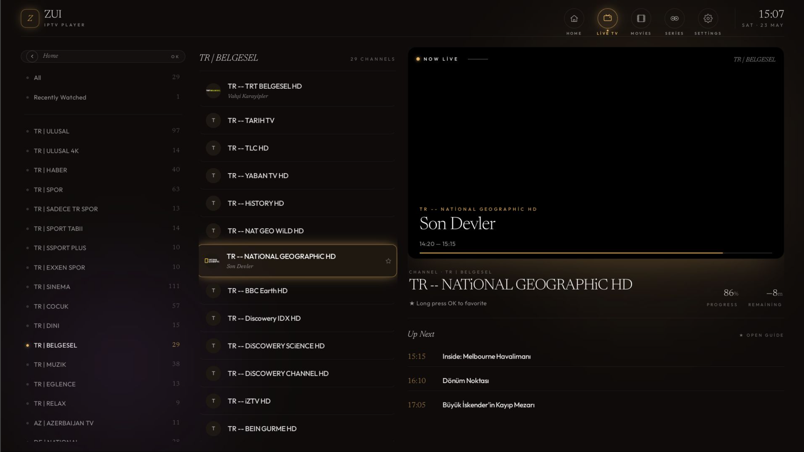
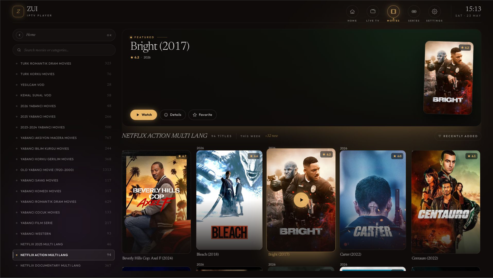
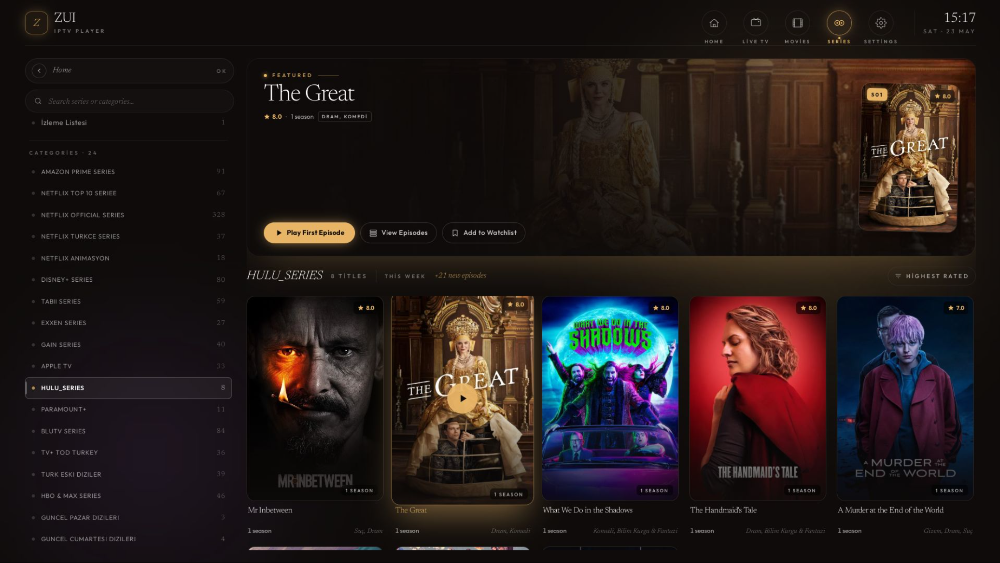
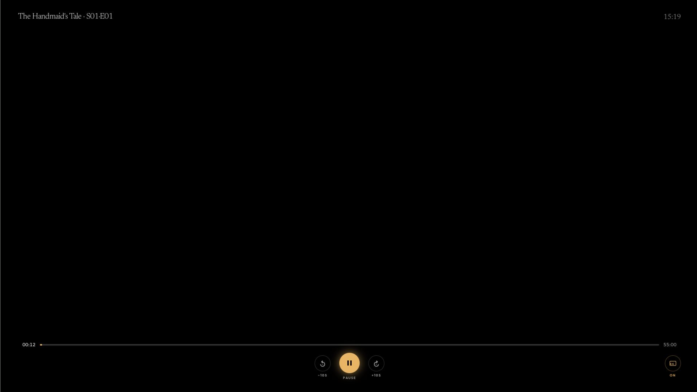
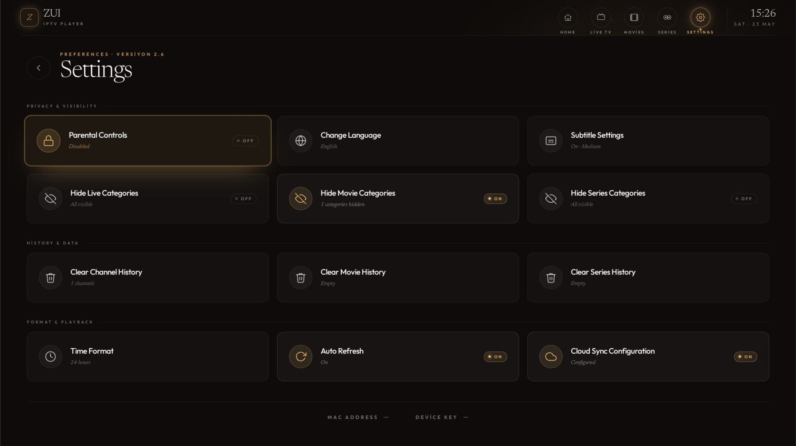
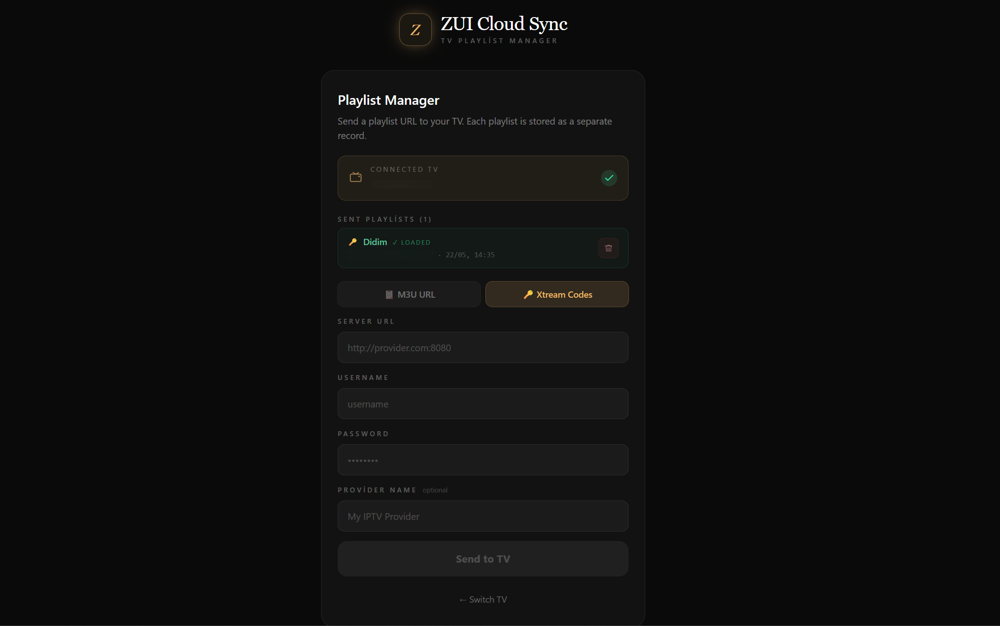

# ZUI IPTV Player

> Modern, keyboard/remote-navigable IPTV client built for **LG webOS TVs**.  
> Supports M3U playlists, Xtream Codes (Live · VOD · Series), EPG, Cloud Sync and more.

---

## Screenshots

<!-- Add your screenshots to docs/screenshots/ — they'll render here on GitHub -->

| Home | Live TV |
|------|---------|
|  |  |

| Movies | Series |
|--------|--------|
|  |  |

| Player (VOD) | Settings |
|--------------|----------|
|  |  |

**Cloud Sync Web Panel** — [zui-sync-web.vercel.app](https://zui-sync-web.vercel.app)



---

## Features

- 📺 **Live TV** — channel list with categories, EPG now/next, favorites, recently watched
- 🎬 **Movies (VOD)** — full poster grid, sort by date/rating/year/title, favorites, resume progress
- 📼 **Series** — season/episode browser with continue-watching support
- 📡 **EPG** — XMLTV guide with timeline view
- 🔄 **Multi-source** — M3U URL + Xtream Codes, multiple sources simultaneously
- ☁️ **Cloud Sync** — push your playlist from browser/phone to TV via Supabase
- 🔤 **Subtitles** — CC quick-toggle in player OSD, size control (small/medium/large)
- 🔒 **Parental control** — PIN-protected categories
- 🌍 **5 languages** — Turkish, English, German, French, Spanish
- ⌨️ **Full D-pad navigation** — spatial nav for LG Magic Remote and standard remote
- 🎨 **Aurora design system** — dark theme, gold accent, glassmorphism cards

---

## Tech Stack

| Layer | Library |
|-------|---------|
| UI | React 18 + TypeScript |
| Styling | Tailwind CSS v3 |
| State | Zustand 4 (with persist) |
| Spatial Nav | `@noriginmedia/norigin-spatial-navigation` |
| HLS playback | hls.js 1.5 |
| MPEG-TS | mpegts.js 1.7 |
| i18n | i18next + react-i18next |
| DB (local) | IndexedDB via `idb` (EPG cache, channel cache) |
| Cloud Sync | Supabase (Realtime + RLS) |
| Build | Vite 5 + `@webos-tools/cli` |

---

## Requirements

- **LG webOS TV** (webOS 4.x or later) in Developer Mode
- Node.js 18+
- `@webos-tools/cli` (`npm i -g @webos-tools/cli`)

---

## Development Setup

```bash
# Clone
git clone https://github.com/YOUR_USERNAME/ZUI_IPTV_Player.git
cd ZUI_IPTV_Player

# Install deps
npm install

# Start dev server (browser preview)
npm run dev
```

> The dev server runs in the browser. Full functionality (especially video playback) requires deployment on a webOS TV.

---

## Build & Deploy to TV

Full sideload instructions: [`docs/SIDELOAD.md`](docs/SIDELOAD.md)

**Quick deploy:**

```bash
# 1. Build
npm run build

# 2. Package → .ipk
ares-package dist

# 3. Install on TV (requires ares-setup-device done once)
ares-install com.zui.player_1.0.0_all.ipk

# 4. Launch
ares-launch com.zui.player
```

---

## Source Types

| Type | How to add |
|------|-----------|
| **M3U URL** | Onboarding → M3U List → paste URL |
| **Xtream Codes** | Onboarding → Xtream Codes → host + user + pass |
| **Cloud Sync** | Onboarding → ZUI Cloud Sync → scan QR on phone/browser |

---

## Cloud Sync Setup

Cloud Sync lets you push a playlist from your phone or browser to the TV instantly.

1. Create a free [Supabase](https://supabase.com) project
2. Run [`docs/cloud-sync/schema.sql`](docs/cloud-sync/schema.sql) in the SQL editor
3. On TV: Settings → Cloud Sync Config → enter your Supabase URL + anon key
4. Scan the QR code from the Onboarding screen with your phone

> The anon key is safe client-side by design — Supabase Row Level Security ensures each TV can only read its own data. Never use the service-role key in this app.

---

## Localization

The app ships with 5 languages selectable from Settings:

| Code | Language |
|------|----------|
| `tr` | Türkçe (default) |
| `en` | English |
| `de` | Deutsch |
| `fr` | Français |
| `es` | Español |

Translation files: [`src/locales/`](src/locales/)

---

## Project Structure

```
src/
├── components/       # Reusable UI components
│   ├── player/       # VideoPlayer, OSD, ErrorOverlay
│   └── ui/           # Toast, Spinner, modal primitives
├── hooks/            # usePlayer, useRemote, useAudioWatchdog, …
├── screens/          # Full-page screens (Home, Live, Movies, Series, …)
├── services/         # API clients, player strategies (Native/HLS/MpegTS)
│   └── playerStrategies/
├── state/            # Zustand stores
├── types/            # Shared TypeScript types
├── locales/          # i18n JSON files (tr, en, de, fr, es)
└── workers/          # Web Workers (M3U parser, EPG parser)
docs/
├── ARCHITECTURE.md
├── SIDELOAD.md
├── PERMANENT_INSTALL.md
└── cloud-sync/
    └── schema.sql
```

---

## License

MIT — see [LICENSE](LICENSE) for details.
